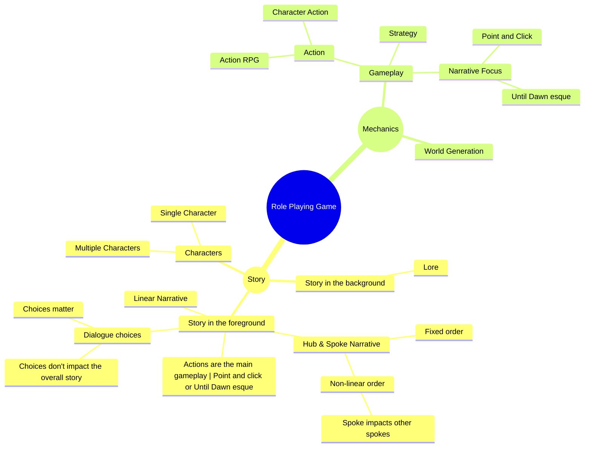
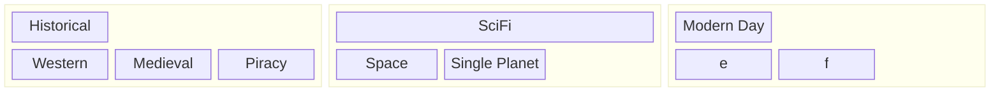

# Variety in RPGs

```mermaid
mindmap
  root((Role Playing Game))
    ((Story))
      Story in the foreground
        Linear Narrative
        Hub & Spoke Narrative
            Fixed order
            Non-linear order
                Spoke impacts other spokes
        Dialogue choices
            Choices matter
            Choices don't impact the overall story
        Actions are the main gameplay | Point and click or Until Dawn esque
      Story in the background
        Lore
      Characters
        Single Character
        Multiple Characters
    
    ((Mechanics))
      Gameplay
        Action
            Action RPG
            Character Action
        Strategy
        Narrative Focus
            Point and Click
            Until Dawn esque
      World Generation
```

# Time period

```mermaid
block-beta
    columns 12
    block
        columns 3
        Historical:3 
        Western Medieval Piracy
    end
    block
        columns 3
        SciFi:3
        Space sp["Single Planet"]
        
    end
    block
        columns 3
        md["Modern Day"]:3
        e f
    end
```
